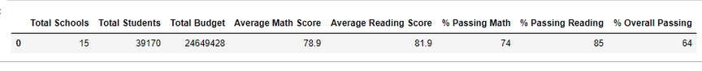
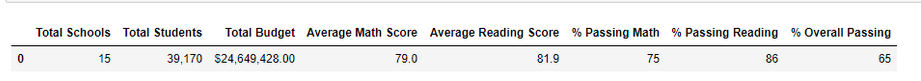
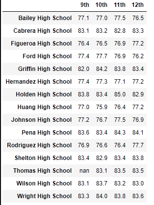
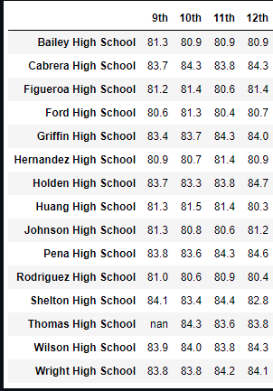

# School_District_Analysis

## **Overview of Project**

The porpuse of this new project is delivery the analysis of the schools:

-A high-level snapshot of the district's key metrics, presented in a table format
-An overview of the key metrics for each school, presented in a table format
-Tables presenting each of the following metrics:
-Top 5 and bottom 5 performing schools, based on the overall passing rate
-The average math score received by students in each grade level at each school
-The average reading score received by students in each grade level at each school
-School performance based on the budget per student
-School performance based on the school size 
-School performance based on the type of school

#Before

#After

### Results

How is the district summary affected?
Turning to null data the information of 461 of Thomas High School do not affect directly the global stats

How is the school summary affected?
It was a huge impact removing 9th-grade students from the analysis, dropping  from 91% the overall rate to 65%

How does replacing the ninth graders’ math and reading scores affect Thomas High School’s performance relative to the other schools?
THS was ranked in the very top, after the null data the position drop to 15th 

How does replacing the ninth-grade scores affect the following:

-Math and reading scores by grade

##Summary

Analyzing data can help us to know the impact of the distribution of the budget and also the benefit of the size of the school in the students

unfortunately, the data of the dishonesty student is not enough to determinate a global or district  scale, the impact was only in local 
